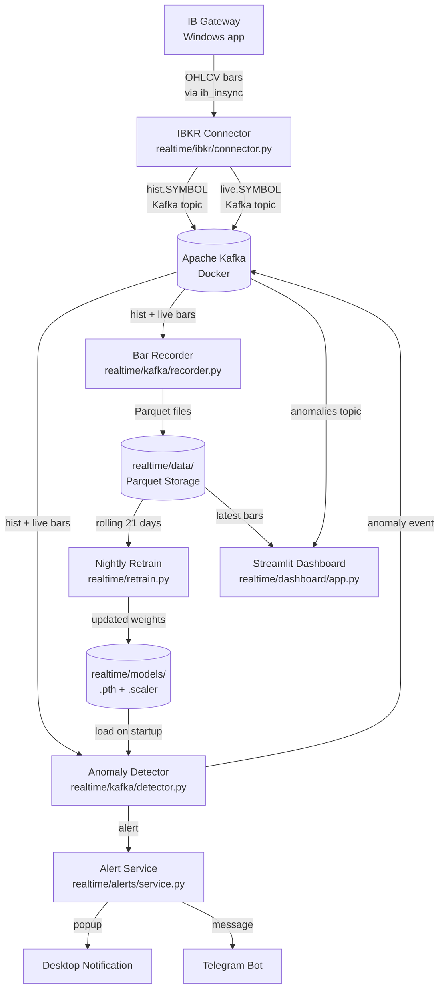
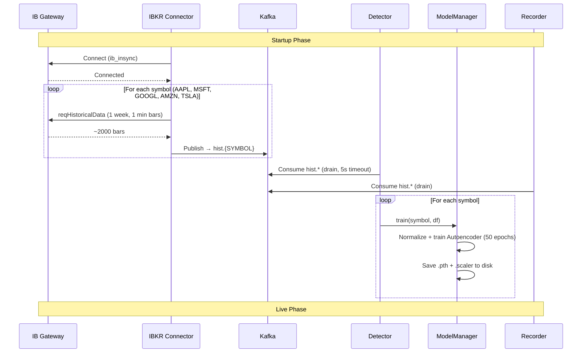
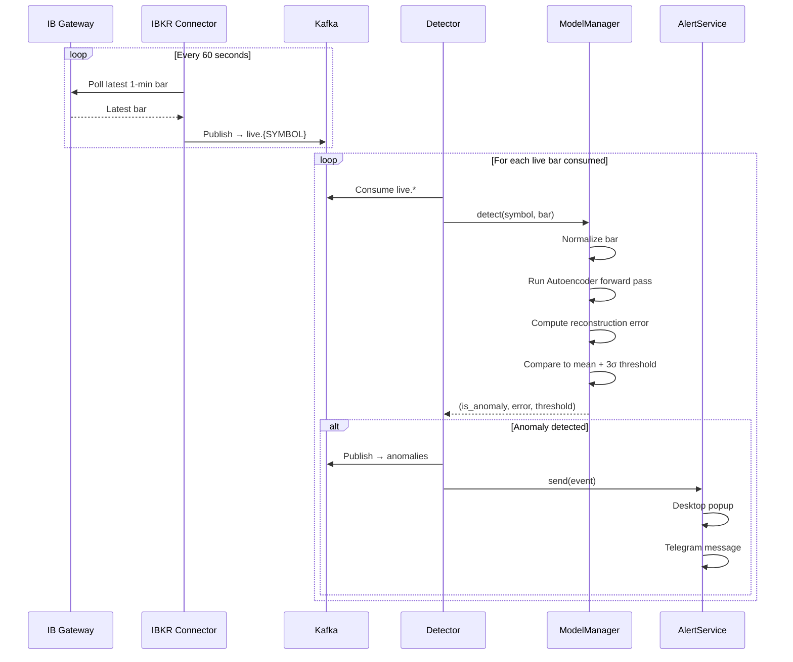
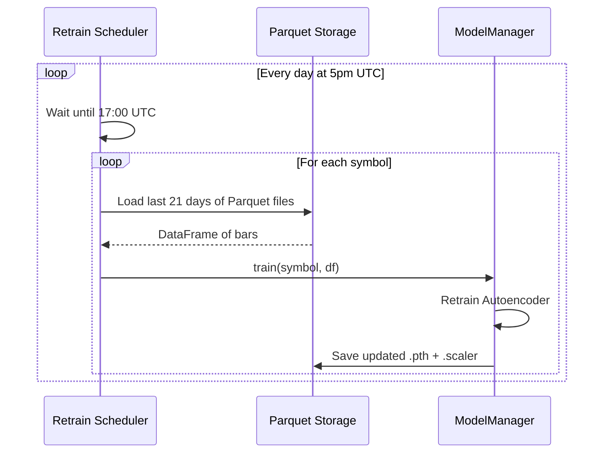
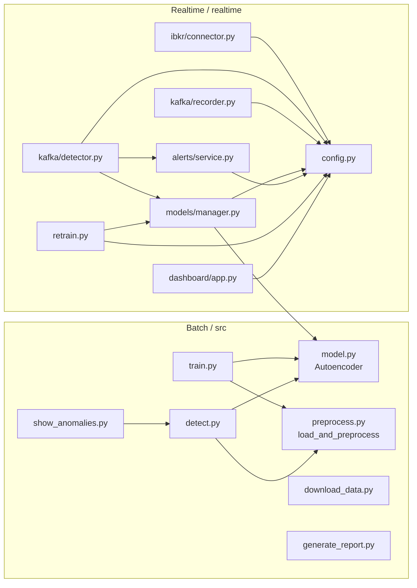

# Market Anomaly Detector — Design Document

## Table of Contents
1. [Project Overview](#1-project-overview)
2. [High-Level Architecture](#2-high-level-architecture)
3. [System Components](#3-system-components)
4. [Data Flow](#4-data-flow)
5. [Component Details](#5-component-details)
6. [Infrastructure](#6-infrastructure)
7. [Configuration Reference](#7-configuration-reference)
8. [Running the System](#8-running-the-system)
9. [Testing](#9-testing)
10. [Dependency Map](#10-dependency-map)

---

## 1. Project Overview

This system monitors live stock prices (AAPL, MSFT, GOOGL, AMZN, TSLA) and detects unusual market behavior using an **Autoencoder neural network**. When the model fails to reconstruct a price bar accurately, that bar is flagged as an anomaly and the user is notified via desktop popup and Telegram.

### How anomaly detection works

An Autoencoder is trained to compress and reconstruct "normal" price bars. When market behavior is abnormal (e.g. a flash crash, unexpected spike, or unusual volume), the model produces a poor reconstruction. The reconstruction error is compared against a dynamic threshold:

```
threshold = mean(recent errors) + 3 × std(recent errors)
```

If a bar's error exceeds the threshold, it is flagged as an anomaly.

### Two modes of operation

| Mode | Purpose | Entry Point |
|------|---------|-------------|
| **Batch (offline)** | Download data, train model, detect anomalies, generate reports | `src/` |
| **Realtime (live)** | Stream live prices from IBKR, detect anomalies, send alerts | `realtime/` |

---

## 2. High-Level Architecture



---

## 3. System Components

### Component Summary

| Component | File | Role |
|-----------|------|------|
| IBKR Connector | `realtime/ibkr/connector.py` | Fetches historical + live bars from IB Gateway, publishes to Kafka |
| Anomaly Detector | `realtime/kafka/detector.py` | Trains models on historical bars, detects anomalies on live bars |
| Bar Recorder | `realtime/kafka/recorder.py` | Persists all bars to Parquet files for retraining |
| Model Manager | `realtime/models/manager.py` | Manages training, inference, and persistence for all symbols |
| Alert Service | `realtime/alerts/service.py` | Sends desktop + Telegram notifications |
| Retrain Scheduler | `realtime/retrain.py` | Nightly retraining on rolling 21-day data window |
| Dashboard | `realtime/dashboard/app.py` | Streamlit web UI with live charts and anomaly feed |
| Config | `realtime/config.py` | Central configuration — symbols, ports, thresholds, secrets |
| Autoencoder | `src/model.py` | Neural network definition (used by both batch and realtime systems) |

---

## 4. Data Flow

### 4.1 Startup sequence



### 4.2 Live detection loop



### 4.3 Nightly retrain



---

## 5. Component Details

### 5.1 Autoencoder (`src/model.py`)

The neural network that powers anomaly detection. It learns to compress and reconstruct normal price bars. Unusual bars reconstruct poorly, producing high error.

```
Input (5 features)
    │
    ▼
[Encoder]
  Linear(5 → 64) + ReLU
  Linear(64 → 16) + ReLU
    │
    ▼  (bottleneck — compressed representation)
[Decoder]
  Linear(16 → 64) + ReLU
  Linear(64 → 5)
    │
    ▼
Output (5 features — reconstructed)
```

**Input features:** `open, high, low, close, volume` (StandardScaler normalized)

**Loss function:** Mean Squared Error (MSE) between input and reconstruction

**Anomaly score:** MSE between input bar and its reconstruction

---

### 5.2 IBKR Connector (`realtime/ibkr/connector.py`)

Bridges IB Gateway with Kafka. Runs in two phases:

**Phase 1 — Historical fetch (once at startup)**
- For each symbol, fetches 1 week of 1-minute bars via `reqHistoricalData`
- Publishes each bar as JSON to `hist.{SYMBOL}` Kafka topic
- Waits 1 second between symbols to respect IBKR rate limits

**Phase 2 — Live polling (continuous)**
- Every 60 seconds, polls the last completed 1-minute bar per symbol
- Uses the second-to-last bar (ensures the bar is fully closed)
- Deduplicates by timestamp — only publishes new bars
- Publishes to `live.{SYMBOL}` Kafka topic

**Bar format published to Kafka:**
```json
{
  "symbol": "AAPL",
  "ts": "2026-04-07 10:30:00",
  "open": 184.50,
  "high": 185.10,
  "low": 184.20,
  "close": 184.90,
  "volume": 120500
}
```

---

### 5.3 Anomaly Detector (`realtime/kafka/detector.py`)

The core real-time processing engine. Consumes Kafka messages and runs the ML model.

**Phase 1 — Training (once at startup)**
- Drains all `hist.*` Kafka topics (stops after 5 seconds of no messages)
- Groups bars by symbol
- Calls `ModelManager.train()` for each symbol

**Phase 2 — Detection (continuous)**
- Subscribes to all `live.*` topics
- For each bar:
  - Skips if model not ready for that symbol
  - Calls `ModelManager.detect()` → gets `(is_anomaly, error, threshold)`
  - If anomaly: publishes event to `anomalies` Kafka topic + fires AlertService

---

### 5.4 Model Manager (`realtime/models/manager.py`)

Abstracts all ML operations so the detector doesn't need to know about PyTorch.

**Key responsibilities:**
- Maintains one `Autoencoder` + one `StandardScaler` per symbol (in memory)
- Persists models to `realtime/models/{SYMBOL}.pth` and `.scaler`
- Loads existing models from disk on startup
- Tracks rolling reconstruction error history per symbol
- Applies warmup period (first 10 bars ignored) before flagging anomalies

**Threshold calculation (dynamic, per symbol):**
```python
threshold = mean(error_history) + ANOMALY_THRESHOLD_STD * std(error_history)
```

---

### 5.5 Bar Recorder (`realtime/kafka/recorder.py`)

Silently archives every bar to disk for future retraining.

- Subscribes to all `hist.*` and `live.*` Kafka topics
- Buffers 10 bars in memory before flushing (reduces disk I/O)
- Saves to `realtime/data/{SYMBOL}/{YYYY-MM-DD}.parquet`
- On flush: reads existing file, appends, deduplicates by timestamp, re-saves

---

### 5.6 Alert Service (`realtime/alerts/service.py`)

Handles all user notifications. Used directly by the detector.

**Channels:**

| Channel | Library | Requirement |
|---------|---------|-------------|
| Desktop popup | `plyer` | Must be installed |
| Telegram message | `python-telegram-bot` | `TELEGRAM_BOT_TOKEN` + `TELEGRAM_CHAT_ID` in `.env` |

**Alert message format:**
```
Anomaly detected: AAPL
2026-04-07 10:30:00
Close: $184.90
Reconstruction error: 2.4521 (threshold: 0.9300)
```

---

### 5.7 Streamlit Dashboard (`realtime/dashboard/app.py`)

Web-based monitoring UI at `http://localhost:8501`.

**Layout:**
- **Sidebar**: Symbol selector, last 10 anomaly events from Kafka
- **Main area**: 2-column grid of Plotly charts — one per selected symbol
  - Close price over time (last 200 bars)
  - Red X markers on anomalous bars
  - Latest close price with delta from previous bar

**Data sources:**
- Price data: reads latest Parquet file from `realtime/data/`
- Anomaly events: polls `anomalies` Kafka topic (cached 5 seconds)

---

### 5.8 Retrain Scheduler (`realtime/retrain.py`)

Keeps models current as market conditions change.

- Runs as a daemon process
- Each day at `RETRAIN_HOUR:RETRAIN_MINUTE` (default 17:00 UTC):
  - Loads last `RETRAIN_ROLLING_DAYS` (default 21) calendar days of Parquet data per symbol
  - Retrains `ModelManager` for each symbol
  - New weights are immediately used by the detector on next bar

**One-off retrain:**
```bash
python -m realtime.retrain --now
```

---

## 6. Infrastructure

### Kafka Topics

| Topic | Producer | Consumers | Content |
|-------|---------|-----------|---------|
| `hist.{SYMBOL}` | IBKR Connector | Detector, Recorder | Historical 1-min bars |
| `live.{SYMBOL}` | IBKR Connector | Detector, Recorder | Live 1-min bars (polled every 60s) |
| `anomalies` | Detector | Dashboard | Anomaly events |

### File Storage

```
realtime/
├── data/
│   ├── AAPL/
│   │   ├── 2026-04-01.parquet
│   │   ├── 2026-04-02.parquet
│   │   └── ...
│   ├── MSFT/
│   └── ...
└── models/
    ├── AAPL.pth       ← Autoencoder weights
    ├── AAPL.scaler    ← StandardScaler (pickled)
    ├── MSFT.pth
    └── ...
```

### Docker Services

| Service | Image | Port | Purpose |
|---------|-------|------|---------|
| `kafka` | apache/kafka:3.7.0 | 9092 | Message broker (KRaft mode, no ZooKeeper) |
| `kafka-ui` | provectuslabs/kafka-ui | 8080 | Web UI to inspect topics and messages |

---

## 7. Configuration Reference

All settings are in [`realtime/config.py`](realtime/config.py). Secrets are loaded from `.env` in the project root.

| Setting | Default | Description |
|---------|---------|-------------|
| `SYMBOLS` | `["AAPL","MSFT","GOOGL","AMZN","TSLA"]` | Symbols to monitor |
| `IBKR_PORT` | `4002` | IB Gateway port (4002=paper, 4001=live) |
| `HIST_DURATION` | `"1 W"` | Historical data window for training |
| `HIST_BAR_SIZE` | `"1 min"` | Bar resolution for training |
| `LIVE_BAR_SIZE` | `5` | Live bar polling interval (seconds) |
| `ANOMALY_THRESHOLD_STD` | `3.0` | Sensitivity — lower = more alerts |
| `WARMUP_BARS` | `10` | Bars to skip before flagging anomalies |
| `RETRAIN_ROLLING_DAYS` | `21` | Days of history used for retraining |
| `RETRAIN_EPOCHS` | `50` | Training epochs per retrain |
| `RETRAIN_HOUR` | `17` | Hour (UTC) for nightly retrain |
| `DASHBOARD_PORT` | `8501` | Streamlit dashboard port |
| `DASHBOARD_LOOKBACK_BARS` | `200` | Bars shown per chart |
| `DESKTOP_ALERTS` | `True` | Enable desktop popups |
| `TELEGRAM_BOT_TOKEN` | from `.env` | Telegram bot token |
| `TELEGRAM_CHAT_ID` | from `.env` | Telegram chat ID |

---

## 8. Running the System

### Prerequisites
- IB Gateway running on Windows (paper trading port 4002 or live port 4001)
- Docker Desktop running
- WSL terminal (the project was built for Linux/WSL)
- `.env` file in project root with Telegram credentials

### Startup Order

**Step 1 — IB Gateway (Windows, manual)**
Open IB Gateway, log in, and ensure:
- API → Settings → "Enable ActiveX and Socket Clients" is checked
- Socket port matches `IBKR_PORT` in config (default 4002)

**Step 2 — Kafka (PowerShell or any terminal)**
```bash
docker compose up -d
docker compose ps   # verify both services are healthy
```
Kafka UI available at `http://localhost:8080`

**Step 3 — IBKR Connector (WSL terminal 1)**
```bash
cd /mnt/c/Users/RanSh/Documents/Programming/Cursor/market-anomaly-detector
source venv/bin/activate
python -m realtime.ibkr.connector
```

**Step 4 — Anomaly Detector (WSL terminal 2)**
```bash
source venv/bin/activate
python -m realtime.kafka.detector
```

**Step 5 — Bar Recorder (WSL terminal 3, optional but recommended)**
```bash
source venv/bin/activate
python -m realtime.kafka.recorder
```

**Step 6 — Dashboard (WSL terminal 4, optional)**
```bash
source venv/bin/activate
streamlit run realtime/dashboard/app.py
```
Dashboard available at `http://localhost:8501`

**Step 7 — Retrain Scheduler (WSL terminal 5, optional)**
```bash
source venv/bin/activate
python -m realtime.retrain
```

### Verify alerts are working
```bash
python -c "
import logging
logging.basicConfig(level=logging.INFO)
from realtime.alerts.service import AlertService
a = AlertService()
a.send({'symbol': 'AAPL', 'ts': '2026-04-07 10:00:00', 'close': 185.0, 'error': 9.99, 'threshold': 0.93})
"
```

---

## 9. Testing

Unit tests cover the batch pipeline components.

```bash
source venv/bin/activate
pytest tests/ -v
```

| Test File | What it tests |
|-----------|--------------|
| `tests/test_model.py` | Autoencoder forward pass, shapes, dtypes, trainability |
| `tests/test_preprocess.py` | CSV loading, normalization, NaN handling |
| `tests/test_train.py` | Training pipeline end-to-end |
| `tests/test_detect.py` | Inference and threshold calculation |
| `tests/test_download.py` | yfinance data download |
| `tests/conftest.py` | Shared fixtures (synthetic yfinance-format CSV) |

---

## 10. Dependency Map



---

*Generated: 2026-04-07*
