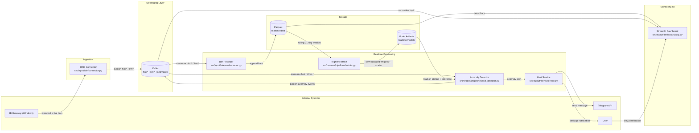

# Architecture Diagram

## Notes

- `hist.*` topics seed model training at startup.
- `live.*` topics drive continuous detection.
- `anomalies` topic feeds dashboard event stream.
- Recorder and retrainer keep model behavior current with market drift.
